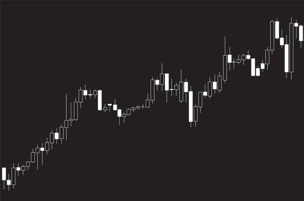

Through my role as a Data Analyst with the Federal Reserve Bank of St. Louis, I collect and analyze employee data that informs strategic leadership decisions. Below are examples of projects I've completed, with certain details altered or omitted to protect confidential information.

# Workforce Insight
::: {style="border: none;"}
<table style="width: 100%; border: none;">
<colgroup>
<col style="width: 25%;">
<col style="width: 75%;">
</colgroup>
<tr style="border: none;">
<td style="border: none; vertical-align: top; padding: 10px;">{width="100%" fig-align="left"}</td>
<td style="border: none; vertical-align: top; padding: 10px;">The Workforce Insight report, distributed quarterly, identifies emerging workforce trends and patterns. Data is collected through our HCM system, Workday, and prepared using Alteryx. </td>
</tr>
</table>
Analysis and visualization are primarily conducted in Tableau, though our team is expanding capabilities in statistical programs like R to deepen analytical insights. The data analytics team collaborates closely with strategic business partners to produce context-rich, action-oriented recommendations. These reports have gained significant visibility among executive leadership and actively inform strategic decision-making.

# Process Automation
::: {style="border: none;"}
<table style="width: 100%; border: none;">
<colgroup>
<col style="width: 75%;">
<col style="width: 25%;">
</colgroup>
<tr style="border: none;">
<td style="border: none; vertical-align: top;">HR departments face constant demands from administrative processes. As a lean organization, minimizing time spent on routine tasks while maintaining accuracy is critical. </td>
<td style="border: none; vertical-align: top; padding: 10px;">{width="100%" fig-align="left"}</td>
</tr>
</table>
I have automated dozens of workflows using PowerApps and Power Automate, which not only saves employee time and reduces errors, but also enables systematic data collection in structured formats (e.g., SharePoint Lists) for ongoing analysis and insights.

# Engagement Survey
::: {style="border: none;"}
<table style="width: 100%; border: none;">
<colgroup>
<col style="width: 25%;">
<col style="width: 75%;">
</colgroup>
<tr style="border: none;">
<td style="border: none; vertical-align: top; padding: 10px;">{width="100%" fig-align="left"}</td>
<td style="border: none; vertical-align: top; padding: 10px;">Each year, the Bank conducts an employee engagement survey to measure employee sentiment—a critical metric that influences organizational direction and predicts key trends such as turnover and performance. </td>
</tr>
</table>
Through several personnel changes, I have consistently managed the engagement survey over the past several years. In this role, I have owned the complete lifecycle: administration, results collection, analysis, and strategic recommendations. Throughout this time, I have guided multiple leaders in successfully navigating the communication and presentation of results to executive leadership.